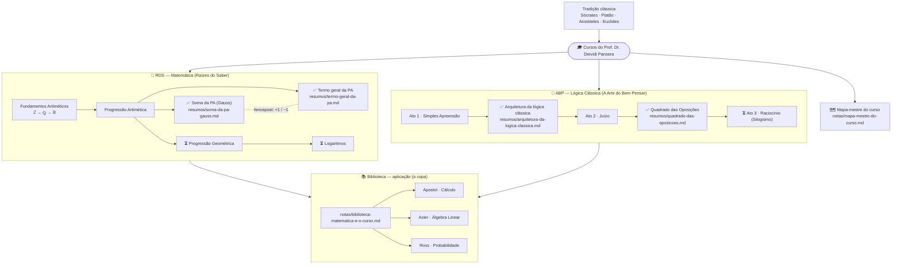

# RDS — Raízes do Saber

Repositório pessoal de estudos do curso de **Matemática "Raízes do Saber"**,
ministrado pelo **Prof. Dr. Deividi Pansera**.

Objetivo: organizar aulas, exercícios, anotações e resumos de forma versionada,
acompanhando o progresso ao longo do curso.

## Mapa do conhecimento

Grafo vivo de tudo o que já construímos no caderno. Atualizado a cada avanço.
**Legenda:** ✅ concluído · ⏳ próximo passo.



## Estrutura

```
aulas/        # material e anotações por aula (uma pasta/arquivo por aula)
exercicios/   # exercícios resolvidos
listas/       # listas de exercícios / problem sets
notas/        # anotações livres, dúvidas, insights
resumos/      # resumos e fórmulas por tópico
```

## Como usar (com o Claude Code)

Este é um projeto **separado**. Para trabalhar nele com o Claude, abra o Claude
**dentro desta pasta** (`RDS/`) — assim ele tem o próprio contexto e memória,
sem misturar com outros projetos.

## Convenções sugeridas

- Nomeie arquivos com data/tópico, ex.: `aulas/2026-06-29-limites.md`.
- Um resumo por tópico em `resumos/` (ex.: `resumos/derivadas.md`).
- Anote dúvidas em `notas/` para revisar depois.

---

*Estudo pessoal. Sem fins comerciais.*

*Os materiais de base utilizados são créditos do curso Raízes do Saber, do Prof. Dr. Deividi Pansera.*
