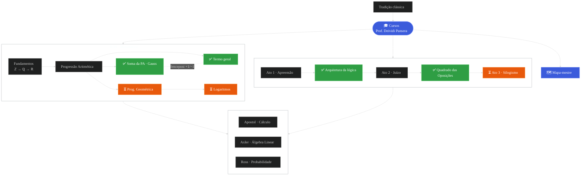

# RDS & ABP — Cadernos de Estudo

Caderno pessoal e versionado de estudos de dois cursos do **Prof. Dr. Deividi Pansera**:

- **Raízes do Saber** — Princípios de Matemática (aritmética, álgebra, progressões, logaritmos);
- **A Arte do Bem Pensar** — lógica clássica (os três atos da mente).

Objetivo: organizar aulas, exercícios, anotações e resumos de forma versionada, registrando o
raciocínio por trás de cada tópico — o *porquê* antes do *como* — e acompanhando o progresso
ao longo dos cursos.

## Mapa do conhecimento

Grafo vivo de tudo o que já construímos no caderno. Atualizado a cada avanço.
**Legenda:** ✅ concluído · ⏳ próximo passo.



**Documentos:**
[Arquitetura da lógica clássica](resumos/arquitetura-da-logica-classica.md) ·
[Quadrado das Oposições](resumos/quadrado-das-oposicoes.md) ·
[Soma da PA (Gauss)](resumos/soma-da-pa-gauss.md) ·
[Termo geral da PA](resumos/termo-geral-da-pa.md) ·
[Mapa-mestre do curso](notas/mapa-mestre-do-curso.md) ·
[Biblioteca matemática](notas/biblioteca-matematica-e-o-curso.md)

## Estrutura

```
aulas/        # material e anotações por aula (uma pasta/arquivo por aula)
exercicios/   # exercícios resolvidos
listas/       # listas de exercícios / problem sets
notas/        # anotações livres, dúvidas, insights
resumos/      # resumos e fórmulas por tópico
```

## Convenções sugeridas

- Nomeie arquivos com data/tópico, ex.: `aulas/2026-06-29-limites.md`.
- Um resumo por tópico em `resumos/` (ex.: `resumos/derivadas.md`).
- Anote dúvidas em `notas/` para revisar depois.

---

*Estudo pessoal. Sem fins comerciais.*

*Os materiais de base utilizados são créditos do curso Raízes do Saber, do Prof. Dr. Deividi Pansera.*
